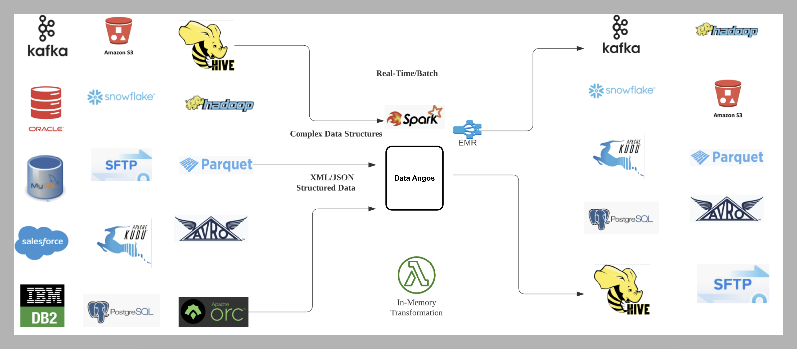
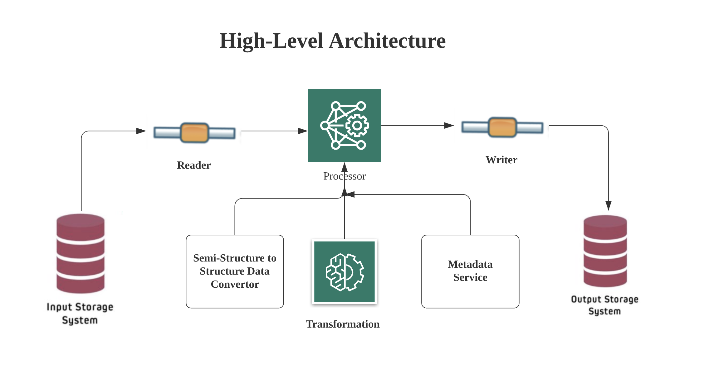

# DataAngos

DataAngos is a custom modular framework that allows us to standardized and customized handling of any data formats with limited amount efforts in terms of coding. It is engineered to be platform agnostic and helps us manage transformations on Cloud as well as On-perm. DataAngos connects a collection of systems and services in a cohesive manner to do the following - 

- Ingest data from multiple data stores into Hadoop/Cloud data lakes.
- In-Memory Transformations
- Real-time/Batch Analytics
- Conversion of complex data structures (JSON/XML with complex nesting) to structured format (Row/Columns). Each module can be run as an individual unit or asynchronously to increase the data throughput.

**Sequential Flow** 

               

You can select source and destination from config file - application.yml and schedule the job on Spark cluster. 

**Architectural View**

The architecture diagram below illustrates the fundamental building blocks and abstractions in DataAngos that enable its overall job flow.

These generic components facilitate the ability to add extensions to DataAngos, letting it support new sources ,sinks and data processors.

 

**Description:**

**Source and Sink:**

DataAngos is rich in connectors and its generic architecture design approach, letting it support new sources and sinks in less development effort.

Configuration based approach allows you to select source and sink based on your requirement. It uses unified analytics engine Spark for large scale data processing. 

Spark provides DAG based data execution technique which lazily evaluates the expression and trigger less load at source and sink side. It supports both Real-Time and Batch source & sink types.  

**Processor:**

DataAngos supports following data processor to process complex and structured data:

- Event Based XML Processor.
- Batch XML Processor.
- Event Based JSON Processor.
- Dynamic JSON Processor.
- Dynamic XML Processor. 
- Default Processor. 

DataAngos provides easy extension of new processor by just implementation of new User-Defined Function.  

**In-Memory Transformation:**

DataAngos provides In-Memory data transformation capabilities with ANSI-SQL. It can perform multiple data transformations without storing data to file system , also performs intermediate optimisation techniques.  

**Metadata Service:**

DataAngos calls metadata service to get X-Path & J-Path for parsing Semi-Structure data processing. It caches metadata information to memory once by calling the metadata rest-end point.  

**Semi-Structure to Structure Data Converter:**

DataAngos supports variety of Data converter which allow you to convert semi-structure data (XML/JSON/Complex-Structures) to structured format with metadata service.

**Process to create jceks File:**
1) Login to HDFS 
2) Execute below command 
   hadoop credential create netezza.password.alias -provider jceks://hdfs/tmp/netezza.password.jceks
3) Check jceks file present at HDFS location - '/tmp/netezza.password.jceks'